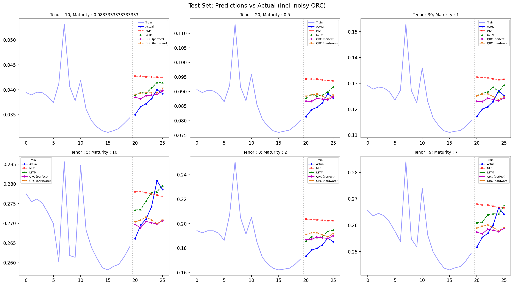
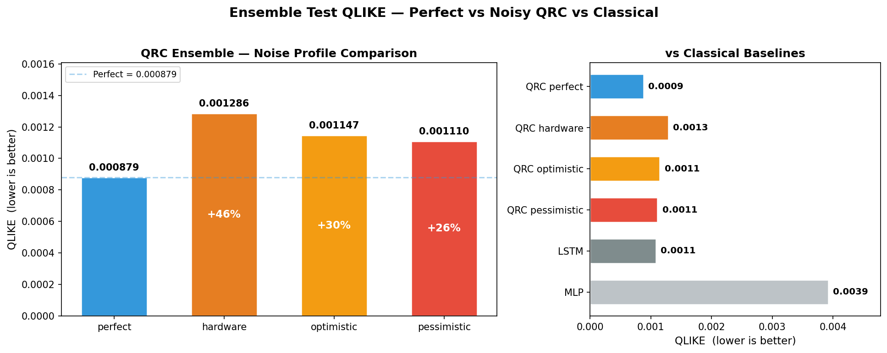

# Quantum Reservoir Computing for Swaption Volatility Forecasting

> **TLDR**: A photonic Quantum Reservoir Computer (10 modes, 5 photons) beats an LSTM baseline by 19% on swaption implied-volatility surface forecasting (QLIKE 0.000879 vs 0.001081). Under hardware-realistic noise the advantage narrows to parity, but all noisy profiles still outperform MLP by >3×.

     

| Model | Test QLIKE | vs LSTM |
|:------|:----------:|:-------:|
| MLP | 0.003921 | +263% |
| LSTM | 0.001081 | — |
| **QRC (perfect sim)** | **0.000879** | **−18.7%** |
| QRC (pessimistic noise) | 0.001110 | +2.7% |
| QRC (optimistic noise) | 0.001147 | +6.1% |
| QRC (hardware noise) | 0.001286 | +19.0% |

*6 test days × 224 instruments. QLIKE = ratio − ln(ratio) − 1 (lower is better).*

## Contents:
[Motivation](#motivation) · [Quick Start](#quick-start) · [Repository Structure](#repository-structure) · [Literature](#literature--background) · [Approach](#approach) · [Results](#results) · [Planned Work](#planned-work) · [Skills & Techniques](#skills--techniques)

---

## Motivation

Swaption implied-volatility surfaces are high-dimensional (14 tenors × 16 maturities = 224 instruments), highly correlated, and notoriously difficult to forecast. Classical deep-learning models (MLP, LSTM) work well but require many trainable parameters relative to the small training set (~435 days).

**Quantum Reservoir Computing** offers an alternative: a fixed random photonic circuit acts as a nonlinear feature engine with *zero* trainable quantum parameters, while a simple Ridge regression handles the readout. This sidesteps barren plateaus and overfitting — key NISQ-era advantages.

This project asks: **can a photonic QRC beat classical baselines on a realistic financial forecasting task, and does the advantage survive hardware noise?**

> **Caveat:** The dataset is *synthetic* (generated by [Quandela](https://huggingface.co/datasets/Quandela/Challenge_Swaptions?_sm_vck=TCQns0CPsvtSr66TLR07ZZTCp7TMC44FZkPJ4sPpp5WM0VMsrDjH) for a hackathon). Results are indicative of the method's potential, not a claim of production-ready quantum advantage. Phase 2 (real market data) is planned — see [Planned Work](#planned-work).

---

## Quick Start

```bash
git clone https://github.com/YOUR_USERNAME/quantum_hackathon_options_pricing.git
cd quantum_hackathon_options_pricing
python -m venv .venv

# Activate:
# Windows PowerShell:  .venv\Scripts\Activate.ps1
# macOS/Linux:         source .venv/bin/activate

pip install -r requirements.txt
python -m ipykernel install --user --name quantum --display-name "Python (quantum)"
```

Then run the notebooks **in order** (1→5) — each one builds on the outputs of the previous:

| # | Notebook | Purpose |
|:-:|----------|---------|
| 1 | `01_EDA.ipynb` | Exploratory data analysis, PCA, stationarity tests |
| 2 | `02_Classical_Baselines.ipynb` | MLP & LSTM baselines (20-day window → 10-day horizon) |
| 3 | `03_QRC.ipynb` | Quantum Reservoir Computing — 30-seed sweep + top-3 ensemble |
| 4 | `04_QRC_Noisy_vs_Perfect.ipynb` | Noise comparison — perfect vs 3 hardware-realistic profiles |
| 5 | `05_Test_Evaluation.ipynb` | Final held-out test evaluation across all models |

Two additional notebooks (`A1_FirstQuantumLayers_with_MerLin.ipynb`, `A2_HOM_Perceval.ipynb`) are pedagogical tutorials on Perceval and MerLin — not required for the pipeline.

---

## Repository Structure

```
├── data/
│   ├── level1.parquet          # Full swaption surface (494 days × 224 instruments)
│   ├── level2.parquet          # Subset with missing values (489 days) — intended for data imputation challenge
│   └── test.xlsx               # Held-out test set (6 days)
├── notebooks/                  # Main pipeline (run in order)
├── models/
│   ├── mlp_best.pt             # Trained MLP weights
│   ├── lstm_best.pt            # Trained LSTM weights
│   ├── reservoir_seed{5,15,16}.pt  # Frozen QRC reservoir weights
│   ├── qrc_test_pred.npy       # QRC ensemble test predictions (perfect, from 03_QRC.ipynb)
│   ├── qrc_noisy_test_pred_*.npy   # QRC test predictions per noise profile
│   ├── qrc_noisy_features.npz     # Cached single-seed noisy quantum features
│   └── qrc_noisy_features_ensemble.npz  # Cached ensemble noisy quantum features
├── results/                    # Saved plots (PNG)
└── notes/
    ├── QRC_swaption_pricing.md # Problem decomposition & QRC design rationale
    └── Photonic_QPU.md         # Photonic hardware primer & noise parameter reference 
```

See [QRC_swaption_pricing.md](notes/QRC_swaption_pricing.md) for a from-scratch breakdown of swaptions, the forecasting task, and why QRC fits, and [Photonic_QPU.md](notes/Photonic_QPU.md) for photonic QPU hardware background and detailed noise parameter explanations.

---

## Literature & Background

This project draws on two key ideas:

1. **Quantum Reservoir Computing** — Using a fixed (untrained) quantum circuit as a nonlinear feature map, with a classical readout layer. This avoids the barren plateau problem that plagues variational quantum circuits. See: Li et al., [*Quantum Reservoir Computing for Realized Volatility Forecasting*](https://arxiv.org/pdf/2505.13933) (2025).

2. **Photonic QML with Perceval/MerLin** — Quandela's photonic simulation stack enables photon-number-resolved mode expectations as features, and realistic hardware noise modelling. See: Notton et al., [*Establishing Baselines for Photonic Quantum Machine Learning*](https://arxiv.org/abs/2510.25839) (2025).

The **QLIKE** loss (quasi-likelihood: ratio − ln(ratio) − 1) is the standard volatility forecast evaluation metric in quantitative finance, preferred over MSE because it penalises under-prediction of volatility — a critical property for risk management.

---

## Approach

```
 ┌──────────┐     ┌─────────────┐     ┌──────────────┐     ┌───────────────┐     ┌────────────┐
 │   EDA    │ ──▶ │  Classical  │ ──▶ │     QRC      │ ──▶ │  QRC Noise   │ ──▶ │   Test     │
 │ PCA, ADF │     │  MLP, LSTM  │     │  30-seed     │     │  4 profiles  │     │   Eval     │
 │ stationr │     │  baselines  │     │  ensemble    │     │  perfect vs  │     │  all models│
 └──────────┘     └─────────────┘     └──────────────┘     │  hardware    │     └────────────┘
                                                           └───────────────┘
```

### 1. Data & EDA

The dataset is a synthetic swaption implied-volatility surface: 494 days × 224 instruments (14 tenors × 16 maturities). PCA reveals that **3 components capture 99% of variance** (level, slope, curvature) — highly compressible. Strong autocorrelation confirms that time-series forecasting is viable.

### 2. Classical Baselines

Two neural networks trained on a 20-day sliding window to predict 10 days ahead:

- **MLP** — 3-layer feedforward (64 hidden, dropout 0.3, ~18K params). Overfits on this small dataset.
- **LSTM** — 1-layer recurrent (64 hidden, ~218K params). Better captures temporal structure. Both use early stopping and learning rate scheduling.

### 3. Quantum Reservoir Computing

The core contribution. Architecture:

- **Dimensionality reduction:** PCA (224 → 4 components), angle-encoded to [0, π]
- **Photonic circuit:** 10 modes, 5 photons, 3 temporal steps (memory-loop)
  - 4 input modes carry encoded data; 6 hidden modes retain state across steps
  - Entangling layers (beam splitters and phase shifters, similar to MZI meshes) interleaved with angle-encoding layers
  - Parameters randomised from U(0, 2π) then **frozen** — zero trainable quantum parameters
- **Features:** Mode expectations (10-d vector per step) → concatenated across ensemble seeds
- **Readout:** `RidgeCV` with 50 log-spaced alphas — the *only* trained component
- **Ensemble:** 30-seed × 3-window-size sweep → top-3 by validation QLIKE (seeds 5, 15, 16; all W=20)

**Why this works:** The fixed reservoir provides a rich, nonlinear feature space while Ridge regression prevents overfitting on just 435 training samples. Classical NNs must optimise thousands of parameters on the same data — the QRC has effectively *none*.

### 4. Noise Comparison

To test real-world viability, the same ensemble is re-evaluated under Perceval's `NoiseModel` with four profiles:

| Profile | Brightness | Indistinguishability | g² | Transmittance | Phase noise |
|---------|:----------:|:--------------------:|:--:|:-------------:|:-----------:|
| Perfect | — | — | — | — | — |
| Hardware | 0.15 | 0.92 | 0.01 | 0.1 | 0.05 |
| Optimistic | 0.30 | 0.96 | 0.005 | 0.2 | 0.02 |
| Pessimistic | 0.08 | 0.85 | 0.03 | 0.05 | 0.10 |

Raw Perceval `Processor` objects are used (MerLin's `QuantumLayer` bypasses noise), with the same frozen circuit parameters extracted from saved `.pt` files.

---

## Results

### Test Performance (6 days × 224 instruments)

| Model | Test QLIKE | Test RMSE | vs LSTM (QLIKE) |
|:------|:----------:|:---------:|:---------------:|
| MLP | 0.003921 | 0.015962 | +263% |
| LSTM | 0.001081 | 0.007712 | — |
| **QRC (perfect)** | **0.000879** | **0.009212** | **−18.7%** |
| QRC (pessimistic) | 0.001110 | 0.010294 | +2.7% |
| QRC (optimistic) | 0.001147 | 0.010597 | +6.1% |
| QRC (hardware) | 0.001286 | 0.010608 | +19.0% |





### Noise Analysis

All three noisy QRC profiles cluster at QLIKE 0.0011–0.0013 — essentially the same performance band. The ordering (pessimistic < optimistic < hardware) is **not statistically meaningful** with only 6 test days; noise model parameters interact nonlinearly through the Fock space distribution. Key takeaways:

- **Perfect QRC clearly beats LSTM** (−19% QLIKE)
- **Hardware noise adds a 26–46% penalty** vs perfect simulation
- **That penalty puts noisy QRC at rough parity with LSTM** — still competitive
- **All noisy QRC profiles beat MLP by >3×**
- **Pessimistic is only 2.7% from LSTM** — noise mitigation techniques (ZNE) or larger ensembles could close the gap

> With only 6 test days, these results are indicative rather than statistically conclusive. See [04_QRC_Noisy_vs_Perfect.ipynb](notebooks/04_QRC_Noisy_vs_Perfect.ipynb) for per-day breakdowns and visualisations.

---

## Planned Work

### Phase 2 — Real Market Data (~2–3 days)
- Source SPX swaption implied-volatility data (OptionMetrics via WRDS, or free CBOE delayed data)
- Retrain the full pipeline (PCA → QRC → Ridge) on real surfaces and re-evaluate all models
- Even one asset class would validate whether the QRC advantage transfers from synthetic to real market dynamics

### Pipeline Refactor (~1 day)
- Consolidate notebooks into a single reproducible `run_pipeline.py` with a config-driven interface (YAML/dataclass) for all hyperparameters (modes, photons, PCA dims, window size, seeds, noise profiles)
- Decouple data loading, feature extraction, model training, and evaluation into importable modules under `src/`
- Add CLI flags for sweep vs known-ensemble vs single-seed modes
- Pin random seeds end-to-end for full reproducibility; add `pip freeze` lockfile

### Noise Mitigation & Hardware (~1–2 weeks, dependent on QPU access)
- Apply **Zero-Noise Extrapolation (ZNE)** — run the circuit at multiple noise scales, extrapolate to zero noise — to close the 26–46% noise penalty
- Execute on **Quandela Cloud QPU** to compare real hardware output against simulated noise profiles
- Benchmark photon loss rates and fidelity against the pessimistic/hardware profiles used here

### Scaling & Architecture (ongoing)
- Larger ensembles (>3 seeds), more photonic modes (12–20), and alternative feature extraction (Fock probabilities, bunched expectations)
- Explore **temporal pooling** — varying the number of memory steps (currently 3) as a hyperparameter
- Compare Perceval/MerLin photonic QRC with gate-based QRC implementations (Qiskit, PennyLane) to isolate the contribution of photonic nonlinearity
- Profile simulation time vs circuit size to identify practical scaling limits for classical simulation and where QPU handoff becomes necessary

---

## Skills & Techniques

| Domain | Techniques used |
|---|---|
| **Machine Learning** | PCA dimensionality reduction, MLP & LSTM baselines, hyperparameter sweeps, ensemble selection, RidgeCV regularisation, fair classical-vs-quantum comparison methodology |
| **Quantum Computing** | Photonic QRC design (Perceval/MerLin), Fock-space feature extraction, hardware-realistic noise modelling (5-parameter NoiseModel), parameter management across simulation backends |
| **Quantitative Finance** | Swaption implied-volatility surface forecasting, QLIKE loss, rolling-window train/val/test protocol, out-of-sample evaluation on held-out data |

---

## Attribution

This project originated at the Girls In Quantum Q-Volution Hackathon. **All work in this branch — architecture design, implementation, noise analysis, and evaluation — is entirely independent solo work** extending well beyond the original hackathon scope.