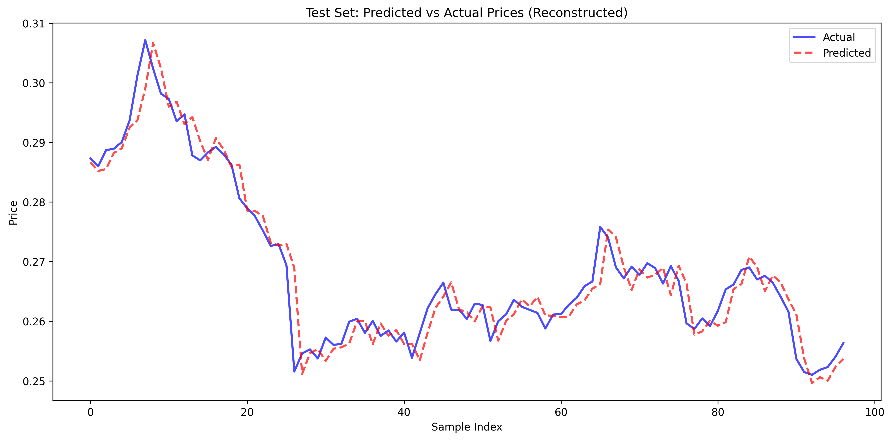

## Q-volution 2026 – Quandela Track (Option Pricing with QML)

This folder contains the Quantum Reservoir Computing (QRC) pipeline for the Q-volution 2026 Hackathon (Quandela: Option Pricing with QML).  
Data is provided as **train** and **test** files (CSV or Excel). The pipeline uses a MerLin-based photonic reservoir and a classical readout (Ridge regression by default, or MLP / LightGBM).

### Folder structure

- **`data/`**: Training and test data (pandas-friendly CSV or original Excel).
  - **`train.csv`** / `train.xlsx`: Training swaption prices (Date + Tenor/Maturity columns).
  - **`test.csv`** / `test.xlsx`: Small labeled test set (if available).
  - **`test_template.csv`** / `test_template.xlsx`: Test template (Date, Type, Tenor/Maturity); may have no labels.
  - **`sample_Simulated_Swaption_Price.csv`** / `.xlsx`: Sample swaption price data.
  - All CSVs are normalized: **Date** first (ISO `YYYY-MM-DD`, sorted), then **Tenor** columns in lexicographic order, **Type** last if present. To regenerate CSVs from Excel: `python scripts/format_data.py`.
- **`scripts/format_data.py`**: Converts Excel files in `data/` to normalized CSV.
- **`src/data_loader.py`**: Data loader with two APIs:
  - Q-volution API (explicit train/test files)
  - Qiskit-Fall-Fest-compatible API: `get_available_pairs`, `prepare_data`, `denormalize`
- **`src/quantum_reservoir.py`**: MerLin-based photonic quantum reservoir with angle/phase encoding only (no amplitude encoding or state injection).
- **`src/model.py`**: Hybrid QML model: quantum reservoir + classical readout (Ridge, MLP, or LightGBM).
- **`main.py`**: Qiskit-Fall-Fest-shaped entry point with `run_experiment(config)` that writes qiskit-like outputs into `results/`.
- **`tune.py`**: Hyperparameter tuning (grid/sampling) that writes `results/tuning_results.json`, `results/best_params.json`, `results/tuning_heatmap.png`.
- **`run_best_params.py`**: Runs `run_experiment` using `results/best_params.json`.
- **`requirements.txt`**: Dependencies (similar role as the old repo).
- **`plot_data.py`**: Optional utility to visualize swaption time series from a single dataset file.
- **`results/`**: Output directory mirroring the old repo:
  - `prediction_plot.png`, `train_predictions.png`, `test_predictions.png`, `residuals.png`, `results_summary.txt`
  - optional: `tuning_heatmap.png`, `tuning_results.json`, `best_params.json`
- **`plots/`**: Output directory for `plot_data.py` figures (if used).
- **`.venv/`**: Python virtual environment (create with the setup below).

### Python environment

From the project root:

```bash
cd q-volution2026_quandela
python -m venv .venv
.venv/bin/python -m pip install -U pip
.venv/bin/python -m pip install -r requirements.txt
```

If you prefer not to use `requirements.txt`, install manually:
`pandas matplotlib openpyxl scikit-learn torch merlinquantum perceval-quandela lightgbm`.

### Dataset format

Train and test files (CSV or Excel) should contain:

- **`Date`**: First column in the normalized CSVs; ISO `YYYY-MM-DD`, sorted ascending. Parsed with `pd.to_datetime` in the loader.
- **Tenor columns**: `Tenor : <T>; Maturity : <M>` (e.g. `Tenor : 10; Maturity : 10`), in lexicographic order in the CSVs. The loader can use a single target column or multiple for multivariate input (then PCA reduces to `n_modes`).
- **Type** (optional): Last column in test/sample files (e.g. test_template, sample_Simulated_Swaption_Price).

The test file may be a submission template (only dates, no price values). Then the pipeline trains on the train file and can write predictions to `results/test_predictions.csv` if test feature rows exist. To get pandas-friendly CSVs from the Excel sources, run from the project root: `python scripts/format_data.py`.

### Running the QRC pipeline

Train and evaluate (Qiskit-Fall-Fest-shaped; single-file interface):

```bash
cd q-volution2026_quandela
.venv/bin/python main.py
```

Example with a specific file and classical backend:

```bash
.venv/bin/python main.py --data_file data/train.csv --regressor lgbm --lookback 8 --n_qubits 8
```

### Results (example run)

The command above produces Qiskit-Fall-Fest-style artifacts under `results/`.

- **Summary file**: `results/results_summary.txt`
- **Plots**:
  - `results/prediction_plot.png`
  - `results/train_predictions.png`
  - `results/test_predictions.png`
  - `results/residuals.png`

**Latest run metrics** (from `results/results_summary.txt`):

- **Config**: `n_qubits=8`, `depth=3`, `encoding=angle`, `lookback=8`, `regressor=lgbm`
- **Test**: R2 = **-0.056195**, MSE = **0.092340**, RMSE = **0.303874**, MAE = **0.221406**, MAPE = **0.9639%**

#### Prediction plot


#### Train predictions


#### Test predictions



#### Residuals


**Key CLI options (kept similar to the old repo):**

| Option | Default | Description |
|--------|---------|--------------|
| `--data_file` | `data/train.csv` | Single dataset file used for chrono train/test split. |
| `--price_column` | `None` | Target column; if omitted uses `Tenor : 10; Maturity : 10` by default. |
| `--tenor`, `--maturity` | `None` | Alternative way to select target column (`Tenor : T; Maturity : M`). |
| `--lookback` | `8` | Number of past time steps per window. |
| `--test_size` | `0.2` | Fraction held out for test (chronological). |
| `--n_qubits` | `8` | Legacy name; mapped to photonic `n_modes` (≤ 20). |
| `--depth` | `3` | Reservoir depth (entangling layers). |
| `--regressor` | `lgbm` | Classical readout: `ridge`, `mlp`, or `lgbm`. |
| `--no_log_returns` | — | Use raw prices instead of log returns (default uses log returns). |
| `--output_dir` | `results/` | Where result files are saved. |
| `--max_samples` | `None` | Cap number of samples (useful for tuning/debug). |

**Behaviour:**

- **Split**: Uses a single file and performs a **chronological train/test split** (same as the old repo).
- **Train**: Builds windows, applies log returns (unless `--no_log_returns`), and z-score normalization (train only). The MerLin reservoir extracts quantum features, then the classical regressor is trained.
- **Outputs**: Writes qiskit-like artifacts to `results/`: `prediction_plot.png`, `train_predictions.png`, `test_predictions.png`, `residuals.png`, `results_summary.txt`.

### Pipeline internals

- **DataLoader** (`src/data_loader.py`): The compatibility API used by `main.py` is `prepare_data()` + `denormalize()`.
- **Quantum reservoir** (`src/quantum_reservoir.py`): MerLin `QuantumLayer` with **angle encoding only** (no amplitude encoding); mode expectations used as features.
- **Hybrid model** (`src/model.py`): Reservoir features → classical regressor (`ridge` / `mlp` / `lgbm`).

### Optional: plot data only

If you have a single dataset file (e.g. Parquet or CSV) and want to plot tenor time series and histograms, you can adapt and run `plot_data.py` (it currently expects a Parquet path; change `DATA_FILE` and the loader as needed).
